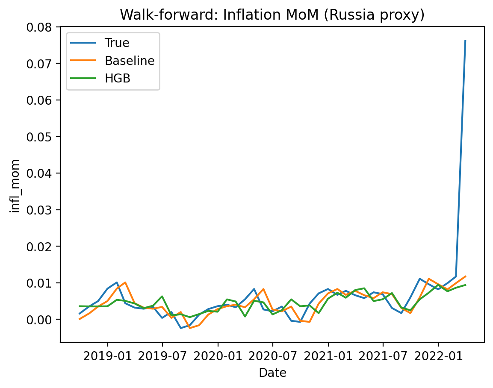

Macro Inflation Forecasting (Time Series, Russia proxy)

Goal
Forecast monthly inflation (MoM) using macro factors (key rate, USD/RUB, Brent) and lag features.
Focus: correct time-series methodology (time split + walk-forward validation) and comparison with a strong baseline.

Data & Features

CPI index (monthly), key rate, USD/RUB, Brent oil.

Target: infl_mom = CPI_t / CPI_{t-1} - 1

Features: lags of inflation, changes in FX/oil, key-rate change.

Models

Baseline: predict next month = previous month (infl_mom_lag1)

HistGradientBoostingRegressor (sklearn)

Results (walk-forward)

Baseline MAE: 0.003526

HGB MAE: 0.003826
Conclusion: on short macro time series, the naive lag baseline is difficult to beat; ML smooths structural shocks.

Artifacts

figures/walkforward_infl_mom.png

figures/walkforward_metrics.csv

figures/walkforward_predictions.csv

Notebook: notebooks/macro_inflation_walkforward.ipynb

Plot

Limitations / Next steps

The sample ends around 2022 for the selected CPI source. The pipeline is reusable with newer CPI data.

Structural breaks (e.g., 2022) require regime/shock indicators or additional exogenous variables.
## Plot

